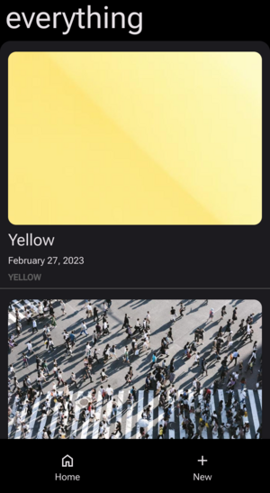
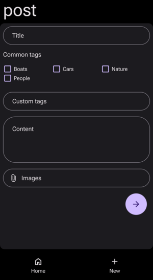

# Home Journal

A self-hosted mini journaling site for familes for capturing memories.

I had an old wordpress blog that I convertered to markdown files. (https://github.com/lonekorean/wordpress-export-to-markdown) and needed a way to view the posts. I was looking for something self-hosted and simple. Some of my design requirements were:

- Mobile friendly and easy to post from mobile
- Need to look and feel like a mobile app
- Needed to be all static files, or as close as I could get
- Needed to be markdown based
- Needed to have a sane directory structure
- No authentication or social auth since this is self-hosted
- No database
- No javascript frameworks
- Minimal dependencies
- No need to edit posts from the UI
- No need to delete posts from the UI
- Ability to regernate all all html file
- Ability to add new posts with a text editor

## What's working

- Index page
- Post page
- New post page
- Tags page
- Progressive web app (PWA) support (requires https)
- PWA as share target
- Responsive design
- Rebuild static html files (http://your.server/all)

## Future enhancements

- Support for videos and other file types
- Roll it in a container

## Installation

- Clone the repo
- Copy the sample_site directory to your desired location, it will be the directory for all content
- Build and source a virtual environment
- Install from the source directory `pip install .`
- Run the server `home-journal -sd /your/site/root --tags cars,people,boats,nature
- Enjoy (http://your.server:8000)

## Thank you

- Slick modern simple CSS https://www.beercss.com/
- Markdown to HTML, github style https://github.com/theacodes/cmarkgfm
- Handy frontmatter extractor https://github.com/eyeseast/python-frontmatter

