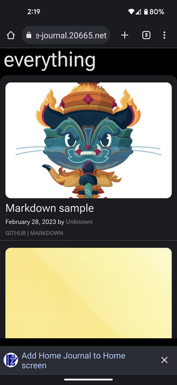

<div>



</div>

# Home Journal

A self-hosted mini journaling site for families for capturing

- memories
- stories
- photos
- ideas
- jokes
- videos
- and anything else you want to remember

I had an old wordpress blog that I converted to markdown files and needed a way to view the posts. I was looking for something self-hosted and simple. Some of my design requirements were:

- Mobile friendly and easy to post from mobile
- Need to look and feel like a mobile app
- Needed to be all static files, or as close as I could get
- Needed to be markdown based
- Needed to have a sane directory structure
- No authentication or social auth since this is self-hosted
- No database
- No javascript frameworks
- Minimal dependencies
- No need to edit posts from the UI
- No need to delete posts from the UI
- Ability to regenerate all html files
- Ability to add new posts with a text editor

## What's working

- Github style markdown formatting
- Index page
- Light/dark modes
- New post page
- Post page
- Progressive web app (PWA) support (requires https)
- PWA as share target
- Rebuild static html files (http://your.server/all)
- Responsive design
- Site initialization
- Splitting Google motion photos into stills and video
- Static files for all but new entry submission
- Tags page
- Video uploads

## Future enhancements

- `¯\_(ツ)\_/¯`

## Installation

```
pip install home-journal --user
```

## Usage

Decide on the directory where you wish to place the site files. (e.g. `/home/user/home_journal`)

```
home-journal --init --site-directory /home/user/home_journal
```

Each time home-journal is run with the `--init` flag it will copy the css, js, and icons from the source tree into the site. If these files have been customized in the site directory, those changes will be overwritten if the `--init` flag is used again.

Until stable releases are available, the css and js files may change so running with the `--init` flag will be necessary. Improvements to the css and js files are welcomed as pull requests to the repository.

## Help

```
usage: home-journal [-h] [-i] [-l {debug,info,warning,error,critical}] [-f LOG_FILE] [-p PORT] -s SITE_DIRECTORY [-t TAGS]

options:
  -h, --help            show this help message and exit
  -i, --init            Initialize the site with css, js, and icons
  -l {debug,info,warning,error,critical}, --log_level {debug,info,warning,error,critical}
                        Log level
  -f LOG_FILE, --log_file LOG_FILE
                        Log file
  -p PORT, --port PORT  Port to run the server on
  -s SITE_DIRECTORY, --site_directory SITE_DIRECTORY
                        Path to the site directory
  -t TAGS, --tags TAGS  A list of tags for new posts
```

## In a container

Although currently a container is not available, a sample Container file is available in the repository.

The container will need python, ffmpeg, and libmagic.

an example using fedora would be:

```
FROM registry.fedoraproject.org/fedora-minimal:38

RUN dnf5 install -y https://download1.rpmfusion.org/free/fedora/rpmfusion-free-release-38.noarch.rpm && \
    dnf5 install -y \
        python3 \
        python3-pip \
        ffmpeg && \
    dnf5 clean all -y

RUN pip install --root-user-action=ignore \
        home-journal==0.0.7
```

built with:

```
podman build  -f Containerfile --tag home-journal
```

and run with:

```
podman run --volume /home/user/site:/mnt/site --publish 9000:8000 home-journal \
    home-journal --log_file /mnt/site/hj.log \
        --log_level debug \
        --site_directory /mnt/site \
        --tags family,friends,food,home,travel \
        --init
```

Where `/home/user/site` is the directory where you wish to place the site files and log file.

Please see the individual files in the root of the repo for the most recent examples.

## Thank you

- Slick modern simple CSS https://www.beercss.com/
- Markdown to HTML, github style https://github.com/theacodes/cmarkgfm
- Github style markdown/html CSS https://github.com/sindresorhus/github-markdown-css
- Handy frontmatter extractor https://github.com/eyeseast/python-frontmatter
- Easy wordpress xml to md https://github.com/lonekorean/wordpress-export-to-markdown
- Sample photos https://unsplash.com/
